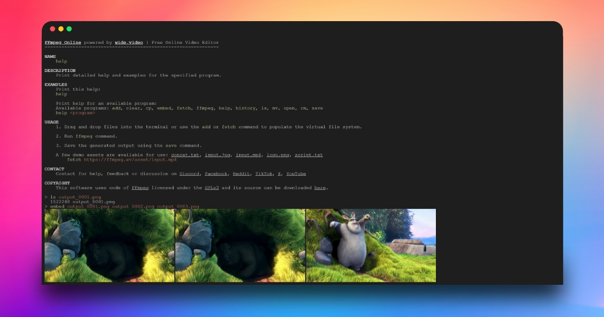
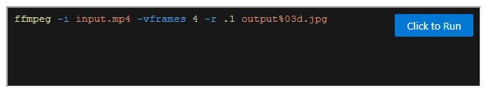

# FFmpeg Online

FFmpeg Online is a web-based application that allows you to run FFmpeg commands directly in your browser. The UI resembles a classic system terminal.

To start using FFmpeg Online, simply visit [ffmpeg.wide.video](https://ffmpeg.wide.video).

[](https://ffmpeg.wide.video)

## Features

- **Runs in Browser**: Execute FFmpeg commands directly from your web browser without the need to install FFmpeg.
- **Privacy and Security**: Local files are processed directly in your browser and are never uploaded to any server.
- **Classic Terminal UI**: User interface mimics a traditional system terminal, making it easy to use for those familiar with command-line interfaces.
- **Built-in Help**: Access built-in help with example FFmpeg commands for common tasks, making it easier to get started.

## Embedding in Your Website

You can easily embed FFmpeg Online in your website using an `<iframe>`. Here’s how you can do it:

```html
<iframe width="600" height="100"></iframe>
<script>
const origin = "https://ffmpeg.wide.video";
const iframe = document.querySelector("iframe");
const commands = [
	`fetch ${origin}/asset/input.mp4`,
	`ffmpeg -i input.mp4 -vframes 4 -r .1 output%03d.jpg`];
const params = {command:commands.join("\n"), placeholder:commands[1]};
const hash = encodeURIComponent(JSON.stringify(params));
iframe.src = `${origin}/#${hash}`;
</script>
```

Here's an example of how it will look:

